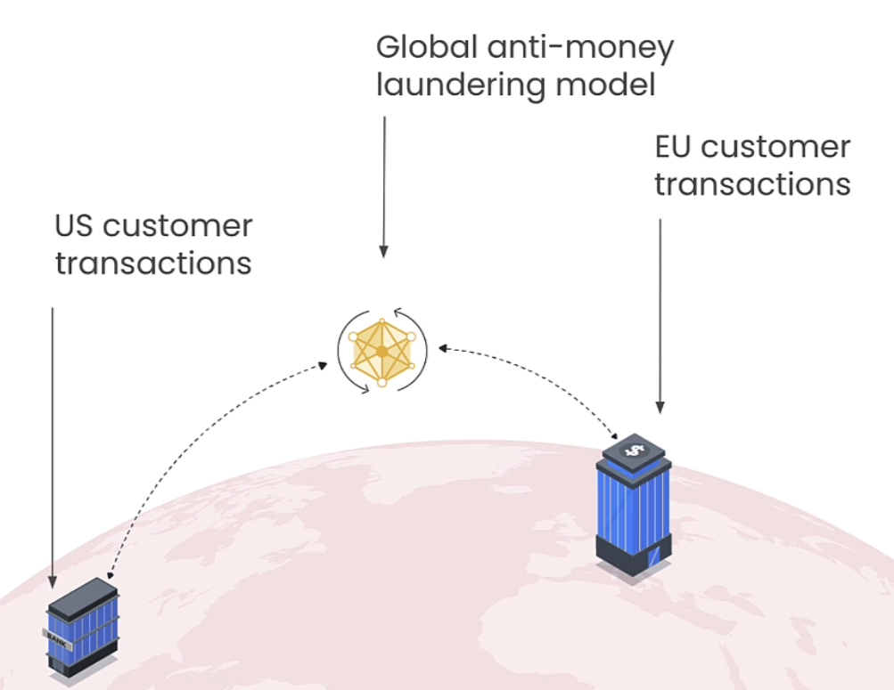
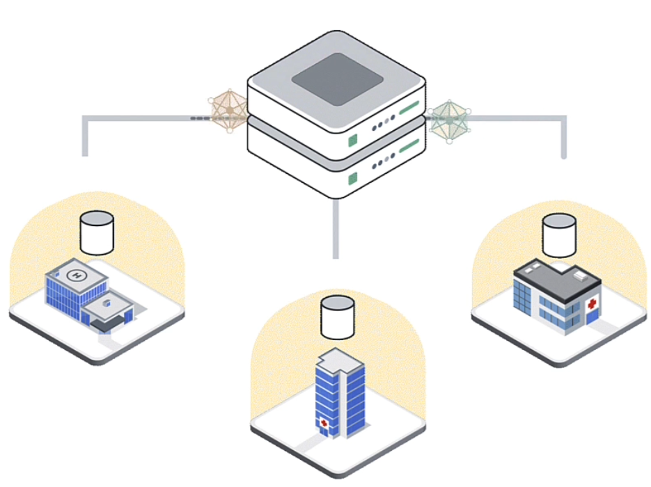
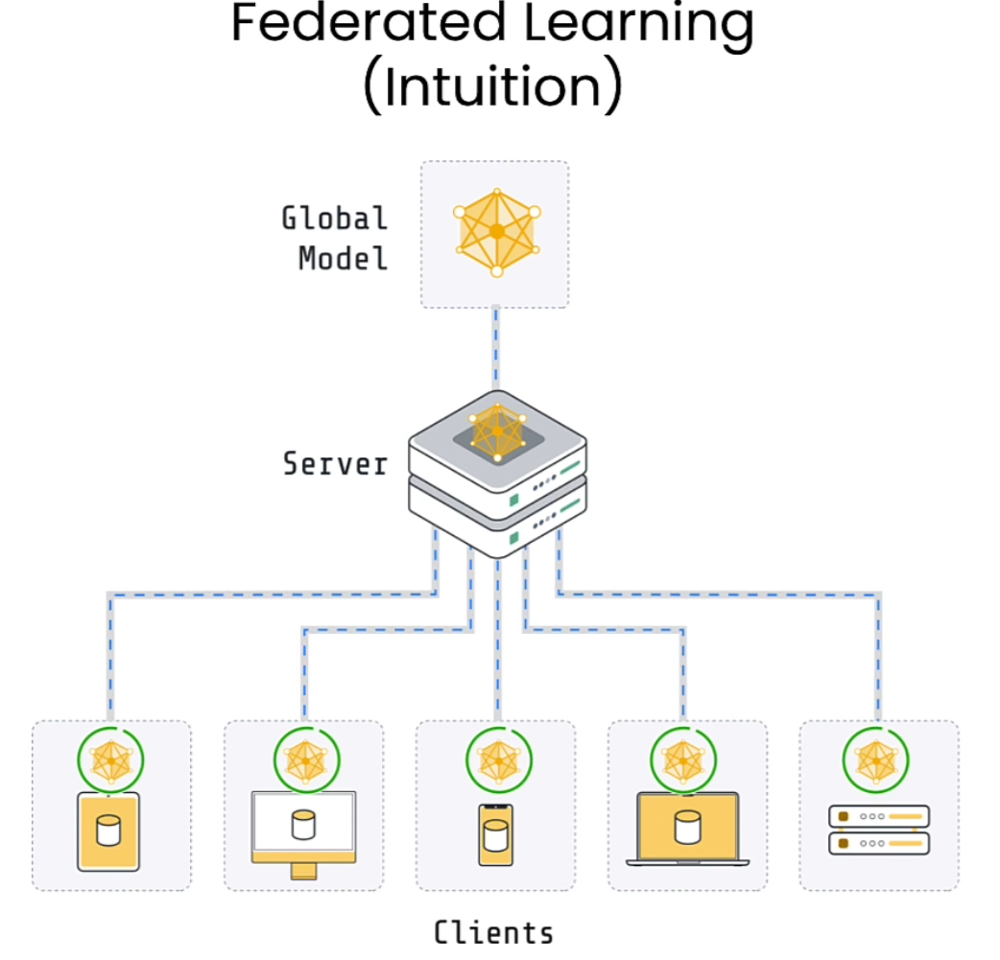
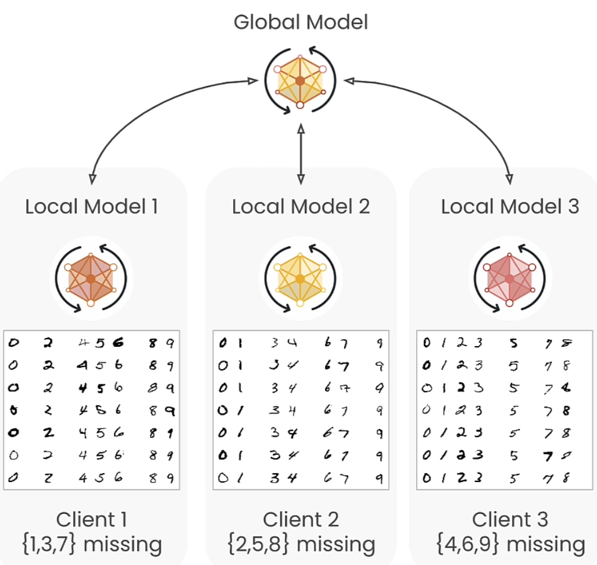

# Intro to Federated Learning

## Getting Started

- Course Link: [Intro to Federated Learning](https://learn.deeplearning.ai/courses/intro-to-federated-learning/lesson/y9bk4/why-federated-learning)

### 1. Why Federated Learning

#### On the importance of training data

- Links: [meta-llama-3](https://ai.meta.com/blog/meta-llama-3/)
- Summary:
  - a large, high-quality training dataset is paramount
  - llama-3, invested heavily in pretraining data.
  - llama-3, pretrained on over 15T tokens from publicly available sources.
  - The training dataset is seven times larger than llama-2 and four times more code.

#### ...but are LLMs running out of training data?

- Links: [educatingsilicon](https://www.educatingsilicon/2024/05/09/how-much-llm-training-data-is-there-in-the-limit)

#### Public data vs private data

#### Data is naturally distributed

- Across organizations
  - Healthcare
  - Government
  - Finance
  - Manufacturing
- Across devices
  - Phones
  - Laptops
  - Automotive
  - Home robotics

> Traditional training assumes centralized data

#### Collecting more data often does not work

- Data needs to move
- Often not possible
- Many reasons
- Sensitive data
- Data volume
- Privacy
- Regulations
- Practicality

#### Federated Learning Idea

- In centralized cata, model can breakdown/failed to predict data that never be seen
- Key idea: Move the training to the data

#### Anti-money laundering in finance

#### Google Gboard on Android

- Next Word Prediction (NWP)
- Smart Compose (SC)
- On-The-Fly-Response (OTF)

#### Health screening using data from multiple hospitals in the UK

#### Review

- Data volume & diversity are critical for training good models
  - But: running out of training data?
  - Yet: large amounts of unused data
- Why?
  - Data is often distributed
  - Traditional training approaches assume centralized data
  - But: it's often difficult/impossible to centralize data

### 2. Federated Training Process

- The role of the servers is to coordinate the training across the clients
- The role o the clients is to do the actual training
- The model in the servers is called **Global Models**
- The model in the clients is called **Local Models**

#### Federated Learning (Algorithm)

1. **Initialization:**  
   Server initializes the global model.
2. **Communication Round:**  
   For each communication round:  
   - Server sends the global model to participating clients.  
   - Each client receives the global model.  
3. **Client Training and Model Update:**  
   For each participating client:  
   - Client trains the received model on its local dataset.  
   - Client sends its locally updated model to the server.  
4. **Model Aggregation:**  
   Server aggregates the updated models received from all clients using an Aggregation Algorithm (for instance, FedAvg).  
5. **Convergence Check:**  
   If convergence criteria are met, end the FL process.  
   If not, proceed to the next communication round (step 2).  

#### What you're about to build

