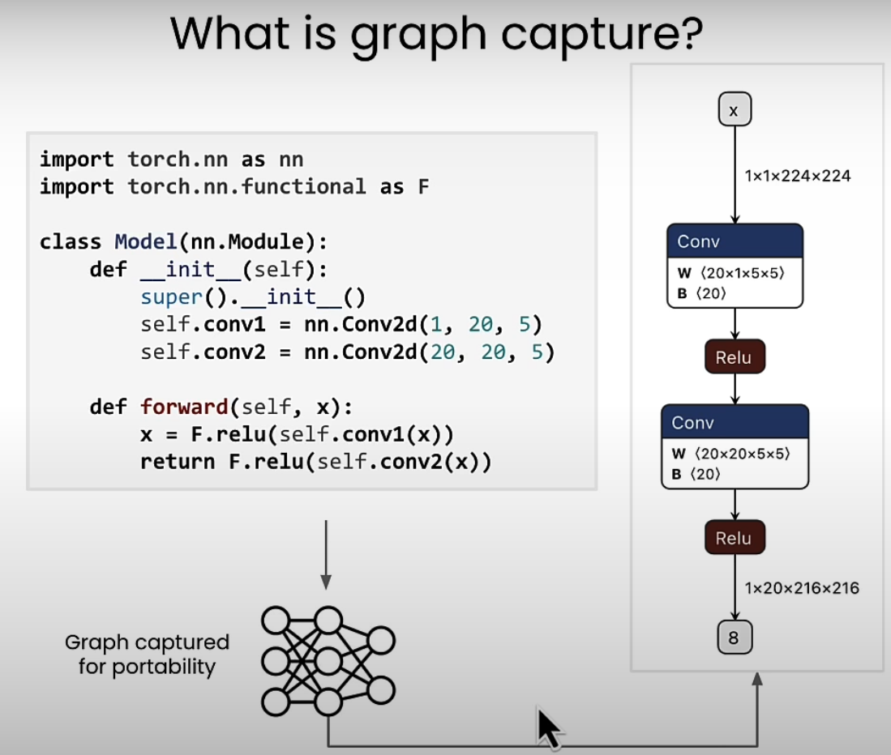
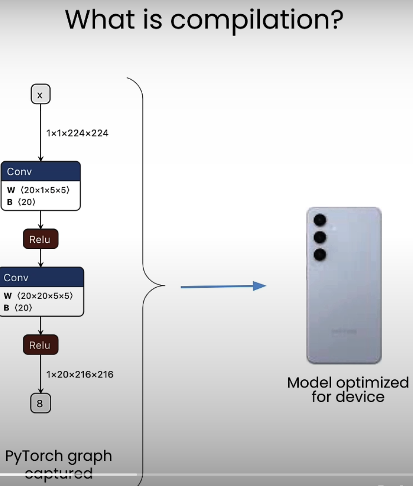
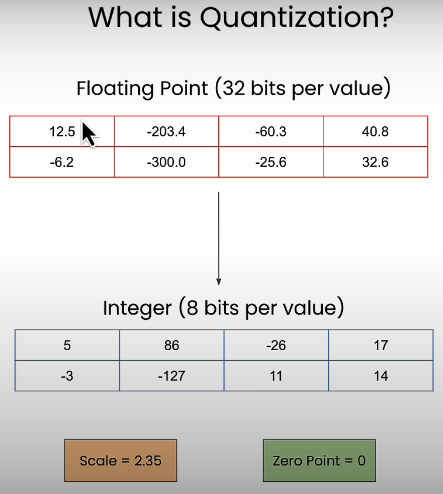
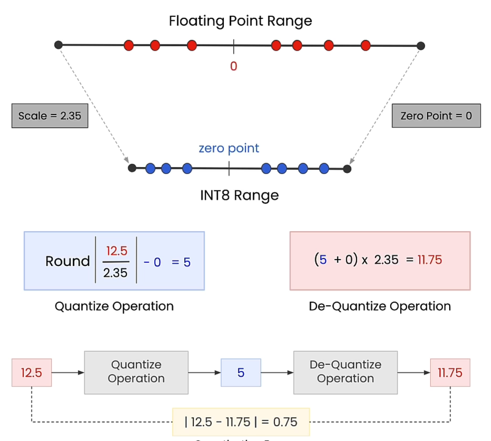
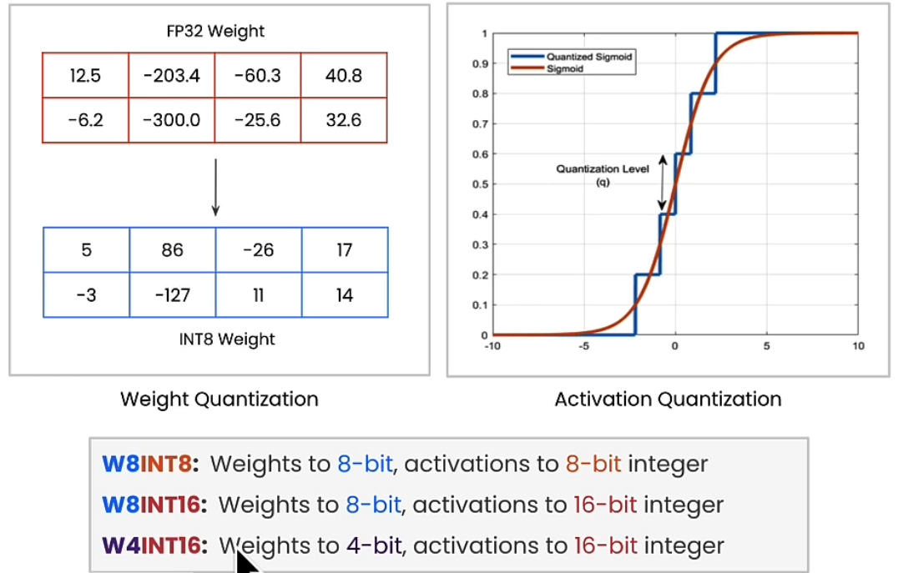
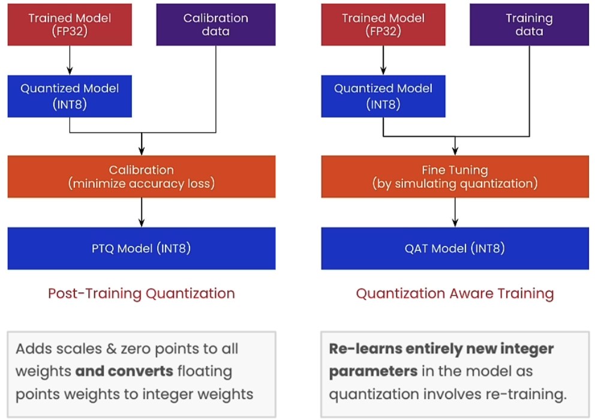
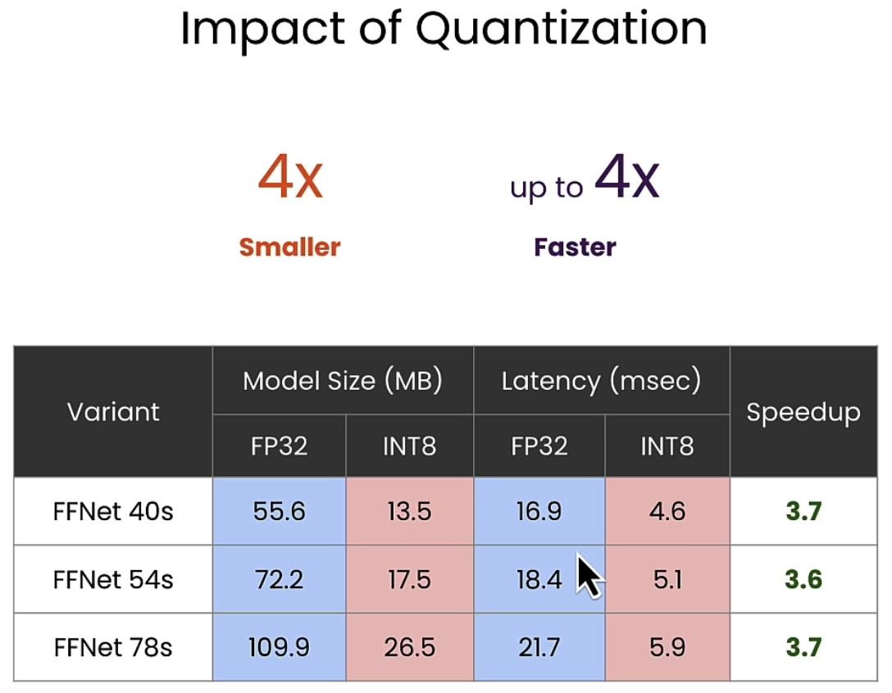
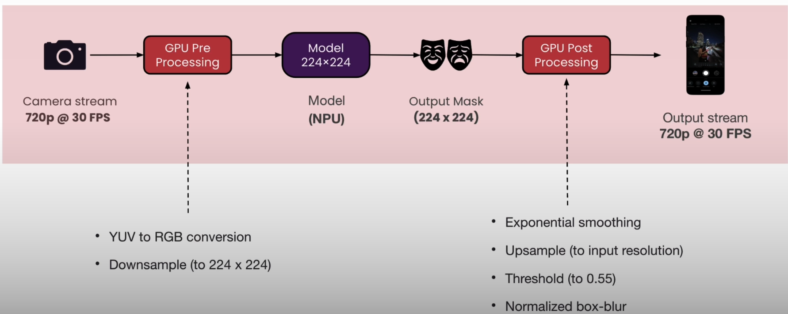
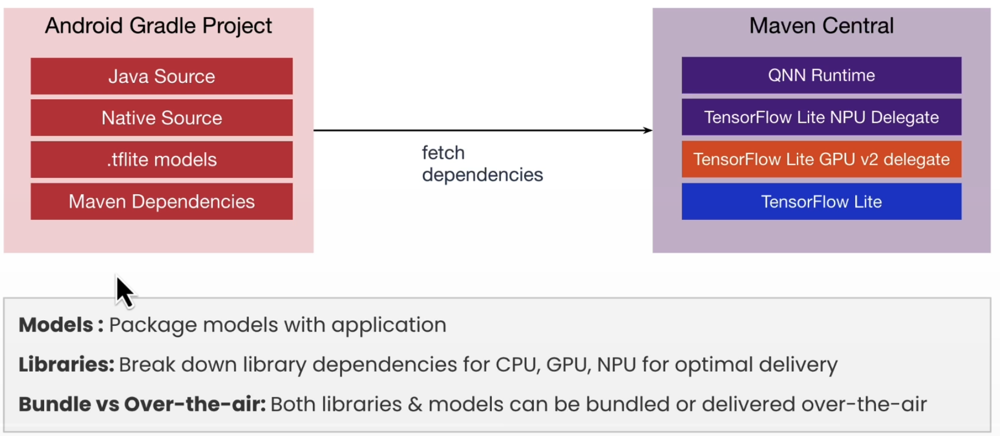

# Introduction to on-device AI

## Table of Contents

- [Introduction to on-device AI](#introduction-to-on-device-ai)
  - [Getting Started](#getting-started)
- [Notes](#notes)
  - [1. Why on-device](#1-why-on-device)
    - [Did you know?](#did-you-know)
    - [Applicable Use-Cases](#applicable-use-cases)
    - [Applicable Industries](#applicable-industries)
    - [Why?](#why)
    - [Device In-the-loop Deployment](#device-in-the-loop-deployment)
    - [On-Device Generative AI](#on-device-generative-ai)
  - [2. Deploying Segmentation Models On-Device](#2-deploying-segmentation-models-on-device)
    - [Useful Links](#useful-links)
    - [What is Image Segmentation](#what-is-image-segmentation)
    - [Types of Image Segmentation](#types-of-image-segmentation)
    - [Applications of Image Segmentation](#applications-of-image-segmentation)
    - [Real-Time Segmentation](#real-time-segmentation)
    - [Semantic Segmentation Models/Algorithms](#semantic-segmentation-modelsalgorithms)
    - [Fuss Free Network (FFNET)](#fuss-free-network-ffnet)
    - [FFNET Variants](#ffnet-variants)
  - [3. Preparing for on-device deployment](#3-preparing-for-on-device-deployment)
    - [On-Device Deployment Key Concepts](#on-device-deployment-key-concepts)
    - [What is graph capture](#what-is-graph-capture)
    - [What is compilation?](#what-is-compilation)
    - [Target Runtime](#target-runtime)
    - [Compute Unit](#compute-unit)
    - [Measure Performance](#measure-performance)
  - [4. Quantizing Models](#4-quantizing-models)
    - [Why quantize?](#why-quantize)
    - [What is Quantization](#what-is-quantization)
    - [Types of Quantization - Type](#types-of-quantization---type)
    - [Types of Quantization - When](#types-of-quantization---when)
    - [Impact of Quantization](#impact-of-quantization)
  - [5. Device Integration](#5-device-integration)
    - [How is the application implemented](#how-is-the-application-implemented)
    - [Runtime Dependencies](#runtime-dependencies)

## Getting Started

- Course Links: [Introduction to on-device AI](https://learn.deeplearning.ai/courses/introduction-to-on-device-ai/lesson/ldet0/introduction?courseName=introduction-to-on-device-ai)

## Notes

### 1. Why on-device

#### Did you know?

- Smartphone Camera: 20+ models run with each picture taken
- IndustrialIOT: Estimated economic impact on-device AI is $3.1T
- ADAS: Advanced driver assistance in entirely on-device AI based

#### Applicable Use-Cases

- Audio & Speech: Text-to-speech, Speech Recognition, Machine Translation, Noise Removal
- Images & Video: Photo classification, QR code detection, Virtual Background Segmentation
- Sensors: Keyboards, Physical Activity Detection, Digital handwriting recognition

#### Applicable Industries

- Mobile
- PC
- Industrial IoT
- Automotive

#### Why?

- **Cost Effective**: Reduces recurring costs by minimizing dependency on cloud computing resources.
- **Efficient**: Faster processing speed and power efficiency by leveraging local computation power.
- **Private**: Keeps data on the device, enhancing security and protecting user-privacy.
- **Personalized**: Allows for continuous model customization without external data transfer or updates.

#### Device In-the-loop Deployment

1. Capture model
2. Compile for target device
3. Validate numerics
4. Measure performance
5. Deploy

> [Qualcomm AI Hub](https://aihub.qualcomm.com/)

#### On-Device Generative AI

- Live translation
- Live transcription
- Photo portrait generation
- Photo Ai editing
- Semantic search
- Text summarization
- Virtual assistants
- Image generation

### 2. Deploying Segmentation Models On-Device

#### Useful Links

- [Qualcomm AI Hub API Token](https://app.aihub.qualcomm.com/account/)
- [Qualcomm AI Hub Documentation](https://app.aihub.qualcomm.com/docs/index.html)

> The models downloaded located in `C:\Users\LENOVO X1E\.qaihm`

#### What is Image Segmentation

Image segmentation **divides an image** into **meaningful segments** for easier object identification and analysis.

#### Types of Image Segmentation

- Semantic Segmentation: Assigns a label to every pixel in an image for classifying entire objects and shapes.
- Instance Segmentation: Distinguishes individual objects within the same category by labelling each instance separately.

#### Applications of Image Segmentation

- Driving Assistance
- Image Editing
- Landscape Mapping

#### Real-Time Segmentation

- **Processing** and segmenting **images instantly** in real-time for immediate analysis or action
- Apply Image Segmentation frame-by-frame

#### Semantic Segmentation Models/Algorithms

- ResNet
- HRNet (High-Resolution Network)
- FANet (Feature Agglomeration Network)
- DDRNet (Dual Dynamic Resolution Network)

#### Fuss Free Network (FFNET)

- Fuss-Free Network (FFNet): A simple encoder-decoder architecture with a RestNet-like backbone and small multi-scale head
- Performance: Performs on-par or better than complex semantic segmentation such as HRNet, FANet, and DDRNets

#### FFNET Variants

| Variant                 | Backbone Encoder | Resolution  | Model Size (MB) | Params (M) | Ops (GFlops) |
|-------------------------|-----------------|-------------|-----------------|------------|--------------|
| FFNet 40s              | Resnet 40S      | 1024 x 2048 | 55.6            | 13.9       | 62.3         |
| FFNet 54s              | Resnet 54s      | 1024 x 2048 | 72.2            | 18.0       | 75.7         |
| FFNet 78s              | Resnet 78S      | 1024 x 2048 | 109.9           | 27.4       | 96.0         |
| FFNet 78s (Low Res)    | Resnet 78S      | 512 x 1024  | 107.3           | 26.8       | 19.9         |
| FFNet 122ns (Low Res)  | Resnet 122N     | 512 x 1024  | 128.6           | 32.1       | 127.4        |

### 3. Preparing for on-device deployment

#### On-Device Deployment Key Concepts

1. Capture Trained Model
2. Compile Model for target
3. Validate On-Target numerics
4. Performance profile on-device

#### What is graph capture

#### What is compilation?

- Take the capture the computation of particular network and compiled it on particular device

#### Target Runtime

- TensorFlow Lite: Recommended for Android applications
  - Optimized for Mobile
  - Low Latency
  - Flexibility in Deployment
  - Energy Efficient
  - Hardware Acceleration
- ONNX Runtime: Recommended for Windows Applications
- Qualcomm AI Engine: Suitable for fully embedded applications

#### Compute Unit

- **CPU**: Most flexible general purpose computation engine
- **GPU**: High-performance complex parallel computation
- **NPU**: Extremely efficient compute block for neural networks

#### Measure Performance

- Model Qualcomm Powered Device: CPU, GPU, NPU
- Older Devices: CPU, GPU

### 4. Quantizing Models

#### Why quantize?

- What is Quantization? The process of reducing precision to speed up computations and decrease size
- 4x Smaller and up to 4x Faster
- Advantages:
  - Reduced Size
  - Faster Processing
  - Energy Efficiency

#### What is Quantization

#### Types of Quantization - Type

- Weights Quantization: Reduces the precision of **model weights** to optimize storage an computational speed.
- Activation Quantization: Applies lower precision to **activation values** to accelerate inference and reduce memory usage.
- Differences:

#### Types of Quantization - When

- Post Training Quantization (PTQ): Quantization applied after model has been trained by calibrating the trained model using sample data.
- Quantization Aware Training (QAT): Quantization applied into the training process of the model by simulating effects of quantization
- Workflow: 

#### Impact of Quantization

### 5. Device Integration

- Understanding how the data flow from the input to the output

#### How is the application implemented

- **Camera Stream:** Extract RGB or YUV data from the camera stream at 30 FPS. Setup camera stream for processing.
- **Implement Pre-processing:** Use OpenCV on the GPU for faster pre-processing.
- **Model Inference:** Use the runtime APIs (C++, Java) for model inference.
- **Implement Post-processing:** Use OpenCV on the GPU for faster post-processing.
- **Packaging Runtime:** Make sure to package all the runtime dependencies for hardware acceleration.

#### Runtime Dependencies

