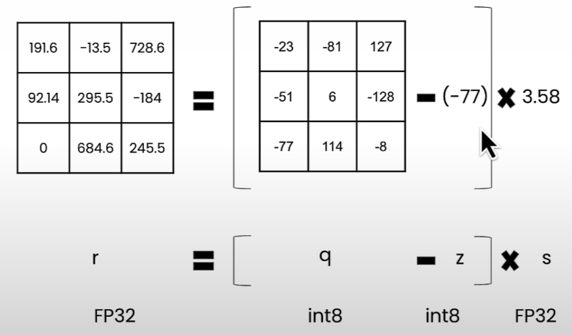

# Quantization in Depth

## Table of Contents

- [Quantization in Depth](#quantization-in-depth)
  - [Getting Started](#getting-started)
- [Notes](#notes)
  - [1. Overview](#1-overview)
  - [2. Quantize and De-quantize a Tensor](#2-quantize-and-de-quantize-a-tensor)
    - [Neural Network Quantization](#neural-network-quantization)
    - [Advantages](#advantages)
    - [Challenges of Quantization](#challenges-of-quantization)
    - [Linear Quantization](#linear-quantization)
    - [From `r` to `q`](#from-r-to-q)
  - [3. Get the Scale and Zero Point](#3-get-the-scale-and-zero-point)
    - [Scale and Zero Point](#scale-and-zero-point)
    - [Why make `z` an integer?](#why-make-z-an-integer)
    - [Zero Point Out of Range](#zero-point-out-of-range)
  - [4. Symmetric vs Asymmetric Mode](#4-symmetric-vs-asymmetric-mode)
    - [Linear Quantization Mode](#linear-quantization-mode)
    - [Trade-off Linear Quantization Mode](#trade-off-linear-quantization-mode)
  - [5. Finer Granularity for More Precision](#5-finer-granularity-for-more-precision)
    - [Quantization Different Granularity](#quantization-different-granularity)
  - [6. Per Channel Quantization](#6-per-channel-quantization)
  - [7. Per Group Quantization](#7-per-group-quantization)
  - [8. Inference Linear Quantization](#8-inference-linear-quantization)
  - [9. Custom Build an 8-Bit Quantizer](#9-custom-build-an-8-bit-quantizer)
  - [10. Weights Packing](#10-weights-packing)
    - [Why Packing is Important](#why-packing-is-important)
    - [How Does Packing Work?](#how-does-packing-work)
  - [11. Unpacking 2-Bit Weights](#11-unpacking-2-bit-weights)
  - [12. Beyond Linear Quantization](#12-beyond-linear-quantization)
    - [Other Challenges](#other-challenges)
    - [Challenges of Quantization](#challenges-of-quantization)
    - [Further Reading](#further-reading)


## Getting Started

- Course Links: [Quantization in Depth](https://learn.deeplearning.ai/courses/quantization-in-depth/lesson/oppyc/introduction?courseName=quantization-in-depth)

## Notes

### 1. Overview

- **Quantization**: Store the parameters of the model in lower precision
- **Knowledge distillation**: Train a smaller model (student) using the original model (instructor)
- **Pruning**: Remove connections (weights) from the model

### 2. Quantize and De-quantize a Tensor

- 8-bit quantization: map values that are stored in `torch.float32` to `torch.int8` (e.g. between [-128,127])


#### Neural Network Quantization

You can quantize: 
- **The weights**: Neural network parameter
- **The activations**: Values that propagate


If you quantize the NN after it has been trained, you are doing **post training quantization** (PTQ)

#### Advantages 

- Smaller model
- Speed gains
  - Memory bandwidth
  - Faster operations
    - GEMM: General Matrix Multiply (matrix to matrix multiplication)
    - GEMV: General Matrix Vector Multiplication (matrix to vector multiplication)

#### Challenges of Quantization

- Quantization error
- Retraining
- Limited Hardware Support
- Calibration dataset needed
- packing/unpacking

#### Linear Quantization


idea: linear mapping
Formula: `r = s(q - z)` (De-Quantization)

Example with `s=2` and `z=0`:
- we get: `r=2(q-0)=2q`
- For `q=10`, we have `r=2*10=20`

Example with 8 bit



#### From `r` to `q`

Formula: `q=int(round(r/s+z))` (Quantization)

See the derivation to get `q` in the `CODE/L2_linear_I_quantize_dequantize_tensor.ipynb`

### 3. Get the Scale and Zero Point

How to determine `s` and `z`?

#### scale and zero point

Check the derivation in the `L2_linear_I_get_scale_and_zero_point.ipynb`

#### Why make `z` an integer?

Represent **zero** (in the original `r` range) with an integer in the quantized `q` range. E.g, zero-padding in Convolutional Neural Networks use tensors of exactly zero.

#### zero point out of range

- Case 1 (`z` < `q_min`): We set `z=q_min`


- Case 2 (`z` > `q_max`): We set `z=q_max`


### 4. Symmetric vs Asymmetric Mode

#### Linear Quantization Mode

There are two modes in linear quantization:

- Asymmetric: We map [`rmin`,`rmax`] to [`qmin`,`qmax`]. This is what we implemented in the previous lesson
- Symmetric: We map [`-rmax`,`rmax`] to [`-qmax`,`qmax`] where we can set `rmax=max(|r_tensor|)`

We don't need to use the zero point `(z=0)`. This happens because the floating-point range and the quantized range are **symmetric** with respect to zero. Hence we can simplify the equations to:

`q=int(round(r/s))`
`s=r_max/q_max`

#### Trade-off Linear Quantization Mode

- **Utilization of quantized range**:
  - When using asymmetric quantization, the quantized range is fully utilized.
  - When symmetric mode, if the float range is biased towards one side, this will result in a quantized range where a part of the range is dedicated to values that we'll never see. (e.g. RELU where the output is positive).
- **Simplicity**: Symmetric mode is much simpler compared to asymmetric mode.
- **Memory**: We don't store the zero-point for symmetric quantization
- The use case is in 8-bit quantization for below 8-bit, e.g., 2-bit, 3-bit, 4-bit we use asymmetric mode

### 4. Finer Granularity for more Precision

#### Quantization Different granularity


> The colored values share the same quantization parameters (e.g., scale, zero-point)

### 5. Per Channel Quantization


> The colored values share the same quantization parameters (e.g., scale, zero-point)

- The memory needed is small
- We use this scheme in 8-bit quantization


### 5. Per Group Quantization


> The colored values share the same quantization parameters (e.g., scale, zero-point)

Per-group quantization can require a lot more memory. 

Let's say we want to quantize a tensor in **4-bit** and we choose `group_size=32`, symmetric mode (`z=0`), and we store the scales in FP16.

It means that we're actually quantizing the tensor in **4.5-bits** since we have:
- 4 bit (each element is stored in 4 bit)
- 16/32 bit (scale in 16 bits for every 32 elements)

### 6. Inference Linear Quantization

In a neural network, we can quantize the **weights** but also the **activation**. Depending on what we quantize, the **storage** and the **computation** are not the same!


### 6. Custom Build an 8-Bit Quantizer

- It's modality agnostic
- Creating a `W8A16LinearLayer` class to store 8-bit weights and scales, follow along `L4_building_quantizer_custom_quantizer.ipynb`
- Replacing all `torch.nnLinear` layers with `W8A16LinearLayer`, follow along, `L4_building_quantizer_replace_layers.ipynb`
  - Usually in large language models, it usually are better to keep the last module un-quantized for better result
- Building a quantizer and quantize a model end-to-end
- Testing the naive `absmax` quantization on many scenario and study its impact

### 10. Weights Packing

- Why weights packing is important for storing quantized weights
- Store and load 2 & 4-bit weights in a packed uint8 tensor
- Other challenges in quantizing LLMs

#### Why packing is important

- Currently `int4` is not supported in PyTorch, the lowest precision supported is `int8`

```python
import torch

# tensor = torch.tensor([0, 1], dtype=torch.int4) 

tensor = torch.tensor([0, 1], dtype=torch.uint8)
```

Use the lowest support bit (int8 or uint8)! This is not ideal because:

- Your tensor will occupy 8-bit per datapoint and might add a considerable overhead for large models (there would be  no point quantizing to 2/4-bit)

#### How does packing work?

- Consider the tensor below that stores 4 values that can be represented in 2-bit precision, but stored in 8-bit

```python
import torch

tenosr = torch.tensor([1, 0, 3, 2], dtype=torch.uint8)
```

currenlty encoded as:

```python
00000001 0000000 00000011 00000010
```

We can "pack" all these data points into a single 8-bit value: `10110001`

```python
import torch

packed_tensor = torch.tensor([177], dtype=torch.uint8)
```

Advantages: 

- It reflects the "true" memory footprint of the quantized weights

Disadvantages:

- The unpacked tensors need to be a shape with a multiple of 8 // nbits
- It needs to unpack before performing an operation

### 12. Unpacking 2-Bit Weights

`packed_tensor` = torch.tensor([177], dtype=torch.uint8)

The packed tensor is encoded as `10 11 00 01`

We want to "unpack" them by extracting each **2-bit** integers and assigning them into **uint8** integers:

```python
00000001 00000000 00000011 00000010
```

### 13. Beyond Linear Quantization

#### Other challenges

- Emergent features for outliers
  - Need of a special care for outliers (e.g., SmoothQuant, AWQ, GPTQ, ...)
  - The hidden state in the recent release of LLM's have nature (outlier) that make linear quantization obsolete
- [LLM.int8()](https://arxiv.org/abs/2208.07339) - separating the matmul in 2 stages
  - Decompose the matmul into two parts
  - The outlier part and the non-outlier part
  - 8-bit Vector-wise Quantization
  - 16-bit outlier decomposition
- [smoothquant](https://github.com/mit-han-lab/smoothquant)
  - Not only the weights, but in this method it also quantize the activation
- [AWQ](https://github.com/mit-han-lab/llm-awq)

#### Challenges of Quantization

- Retraining (Quantization Aware Training)
- Limited Hardware Support
- Calibration dataset needed
- packing/unpacking

#### Further reading

- SoTA quantization papers
- MIT Han Lab
- transformers quantization docs/blogposts
- llama.cpp discussions
- Reddit (r/LocalLlama)