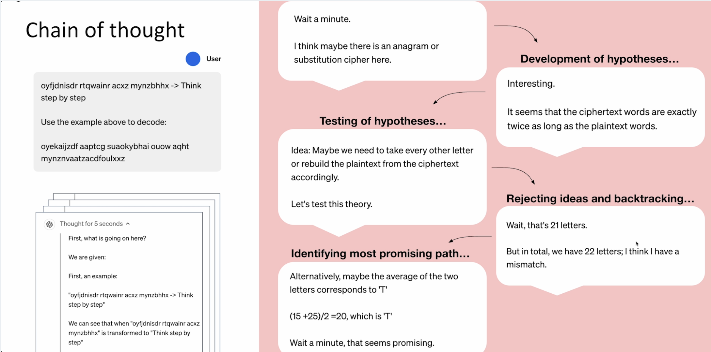
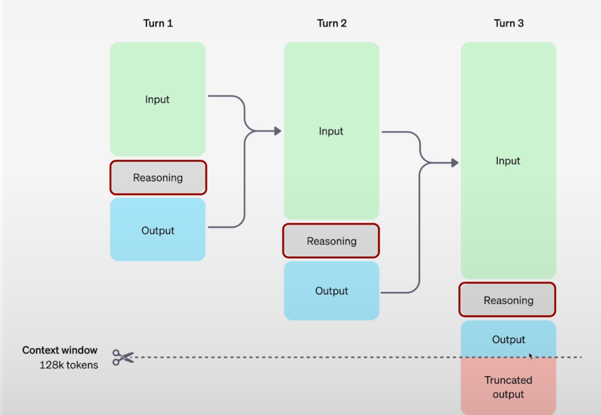
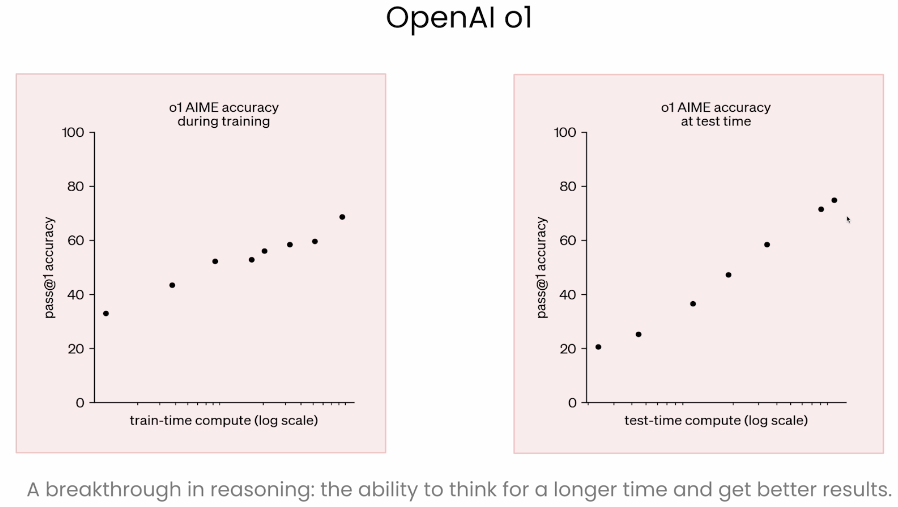
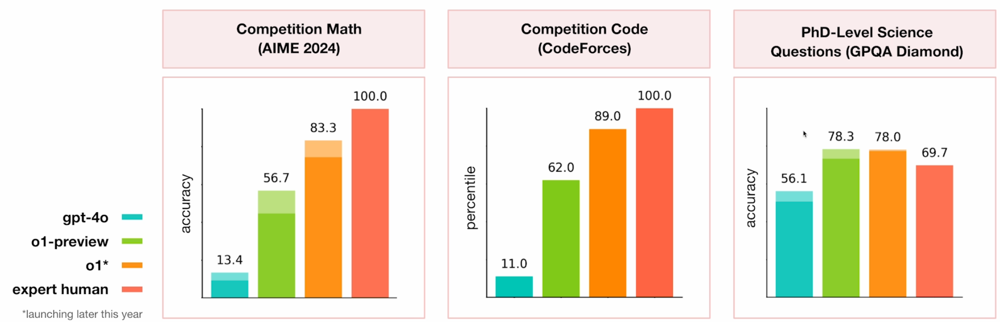
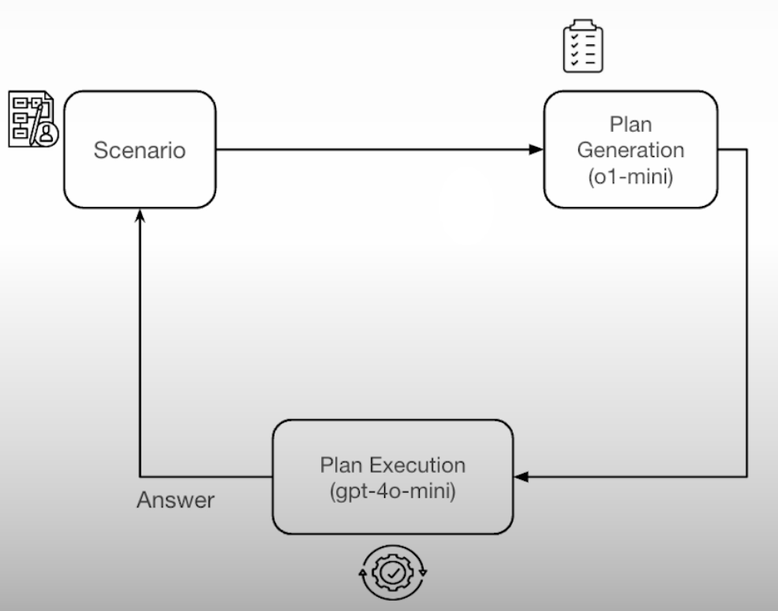
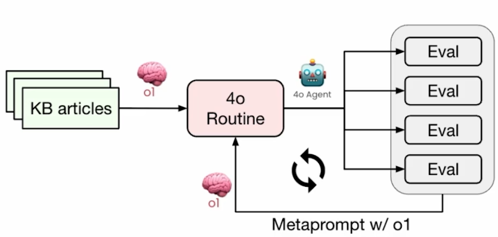
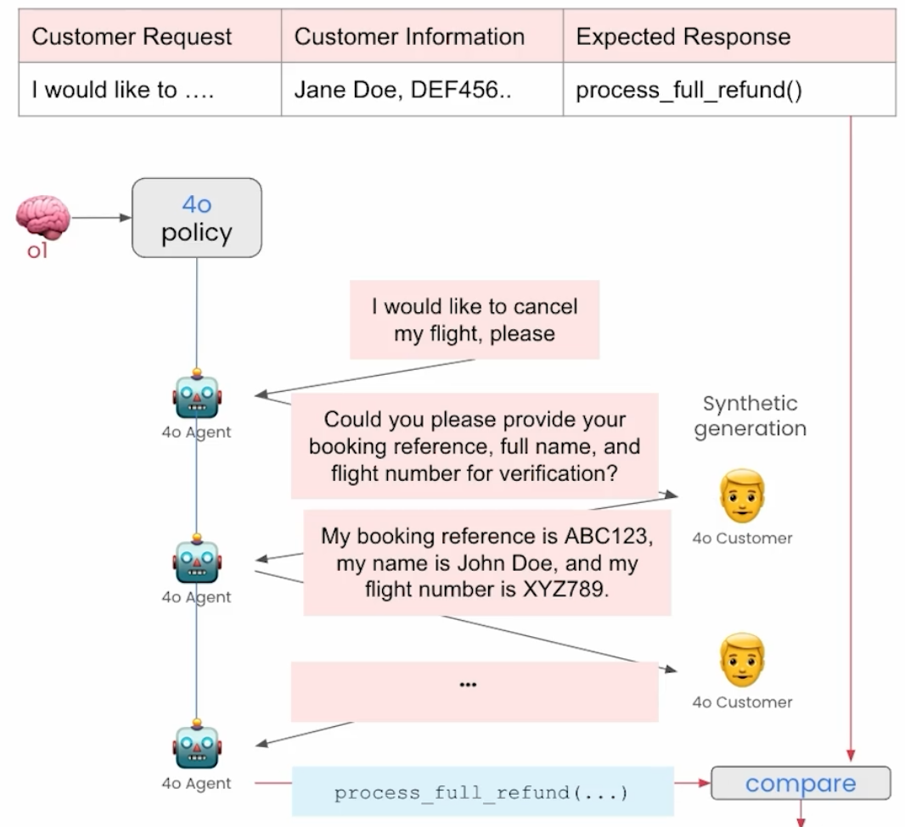

# Reasoning with o1

## Getting Started 

- Course Link: [Reasoning with O1](https://learn.deeplearning.ai/courses/reasoning-with-o1/lesson/h8dkv/introduction?courseName=reasoning-with-o1)

## Useful Links

- [OpenAI API Usage](https://platform.openai.com/settings/organization/usage)

## Introduction to o1

#### Before o1

- **Models are like children**: they always say the first thing that comes to mind.
- **As they grow and mature**, they need to be taught a valuable lesson: Think before you speak

#### o1

- Using reasons through complex tasks in domains like mathematics, coding, science, strategy, and logistics.
- Uses "chain of thought" to explore all possible paths and verify its answers.
- Requires less context and prompting in order to produce comprehensive and thoughtful outputs.

#### Releases

- OpenAI o1
  - New reasoning model for complex tasks that require broad general knowledge
- OpenAI o1-mini
  - A faster, cost-effective reasoning model tailored to coding, math and science

#### Chain of thought

- Rather than the user do manually chaining of thoughts, o1 does it automatically.

#### Completion Tokens

- Generate extra completion tokens to explore more paths.
- Completion tokens can now be broken into two distinct categories
  - Reasoning Tokens
  - Output Tokens

> Reasoning tokens are **not passed** from one turn to the next.

#### OpenAI o1

- Results of o1

#### How does OpenAI o1 work?

- Uses large-scale RL to generate a chain of thought (CoT) before answering.
- CoT is longer and high-quality that what is attained via prompthing
- CoT contains behavior like:
  - Error correction
  - Trying multiple strategies
  - Breaking down problems into smaller steps
- Example CoTs on the research blog post!: [Link](https://openai.com/index/learning-to-reason-with-llms/)

#### Abstract reasoning

#### The Generator-Verifier Gap

- For some problems, verifying a good solution is easier than generating one
  - Many puzzles (Sudoku, for example)
  - Math
  - Programming
- Examples where verification isn't much easier
  - Information retrieval (What's the capital of Bhutan?)
  - Image recognition
- When a generator-verifier gap exists and we have a good verifier, we can **spend more compute on inference to achieve better performance**

#### Where might this be used?

* **Data Analysis**: Interpreting complex datasets (e.g., genomic sequencing results in biology) and performing advanced statistical reasoning.
* **Mathematical Problem-Solving**: Deriving solutions or proofs for challenging mathematical questions or in physics theory.
* **Experimental Design**: Proposing experimental setups in chemistry to test novel reactions or interpreting complicated physics experiments’ outcomes.
* **Scientific Coding**: Writing and debugging specialized code for computational fluid dynamics models or astrophysics simulations.
* **Biological & Chemical Reasoning**: Solving advanced biology or chemistry questions that require deep domain knowledge.
* **Algorithm Development**: Aiding in creating or optimizing algorithms for data analysis workflows in computational neuroscience or bioinformatics.
* **Literature Synthesis**: Reasoning across multiple research papers to form coherent conclusions in interdisciplinary fields such as systems biology.

#### Recap

- The o1 family of models scale compute at inference time by producing tokens to **reason** through the problem
- o1 gives you more **intelligence** as a trade-off against higher **latency** and **cost**
- It can also perform well at tasks that require a **test and learn approach** where it can iteratively verify its results
- Some great emerging use cases are **planning**, **coding**, and **domain-specific reasoning** like law and STEM subjects

### 2. Prompting o1

#### Prompting the o1 models

- **Simple & direct**
  - Write prompts that are straightforward and concise.
  - Direct instructions yield the best results with the o1 models.
- **No explicit CoT required**
  - You can skip step-by-step ('Chain fo Thought') reasoning prompts. The o1 models can infer and execute these itself without detailed breakdowns
- **Structure**
  - Break complex prompts into sections using delimiters like markdown, XML tags, or quotes.
  - This structured format enhances model accuracy - and simplifies your own troubleshooting.
- **Show rather than tell**
  - Rather than using excessive explanation, give a contextual example to give the model understanding of the broad domain of your task.

#### Example of XML tags in Coding

| **Use Case**               | **XML Tag**               | **Purpose**                                           | **Example Sub-Tags**                              |
|----------------------------|---------------------------|------------------------------------------------------|--------------------------------------------------|
| **Code Generation**         | `<CodeGeneration>`        | Request to generate a code snippet                   | `<Language>`, `<Task>`                           |
| **Code Debugging**          | `<CodeDebugging>`         | Find and fix errors in a given code snippet          | `<Language>`, `<Code>`, `<Issue>`                |
| **Code Explanation**        | `<CodeExplanation>`       | Request an explanation of a given code snippet       | `<Language>`, `<Code>`, `<Question>`             |
| **Code Optimization**       | `<CodeOptimization>`      | Request a more efficient version of a given code     | `<Language>`, `<Code>`, `<Goal>`                 |
| **Code Conversion**         | `<CodeConversion>`        | Convert code from one language to another            | `<FromLanguage>`, `<ToLanguage>`, `<Code>`       |
| **Code Review**             | `<CodeReview>`            | Review code based on best practices and efficiency   | `<Language>`, `<Code>`, `<Criteria>`             |
| **Code Testing**            | `<CodeTesting>`           | Generate unit tests for a given function             | `<Language>`, `<Code>`, `<TestFramework>`        |
| **Code Documentation**      | `<CodeDocumentation>`     | Generate docstrings or comments for a given code     | `<Language>`, `<Code>`, `<Format>`               |
| **Code Refactoring**        | `<CodeRefactoring>`       | Improve code readability, modularity, or maintainability | `<Language>`, `<Code>`, `<RefactoringGoal>`      |
| **Code Style Correction**   | `<CodeStyleCorrection>`   | Enforce style guides like PEP8 or Google Style Guide | `<Language>`, `<Code>`, `<StyleGuide>`           |
| **Pseudocode Conversion**   | `<PseudocodeConversion>`  | Convert pseudocode to an actual programming language | `<FromPseudocode>`, `<ToLanguage>`               |
| **Algorithm Explanation**   | `<AlgorithmExplanation>`  | Explain an algorithm step-by-step                    | `<AlgorithmName>`, `<Code>`, `<ComplexityAnalysis>` |
| **Security Audit**          | `<CodeSecurityAudit>`     | Identify vulnerabilities in code                     | `<Language>`, `<Code>`, `<SecurityConcern>`      |
| **Code Snippet Retrieval**  | `<CodeSnippetRetrieval>`  | Retrieve relevant code snippets from a dataset       | `<Query>`, `<ProgrammingConcept>`                |
| **Code Commenting**         | `<CodeCommenting>`        | Add inline comments to an existing code snippet      | `<Language>`, `<Code>`, `<CommentStyle>`         |
| **Performance Analysis**    | `<PerformanceAnalysis>`   | Evaluate code execution time or memory usage         | `<Language>`, `<Code>`, `<PerformanceMetric>`    |
| **Error Message Analysis**  | `<ErrorMessageAnalysis>`  | Explain and suggest solutions for an error message   | `<Language>`, `<ErrorMessage>`                   |
| **Database Query Optimization** | `<DatabaseQueryOptimization>` | Optimize SQL or NoSQL queries                      | `<DatabaseType>`, `<Query>`, `<OptimizationGoal>` |
| **API Endpoint Generation** | `<APIGeneration>`         | Generate API endpoints based on given parameters     | `<Framework>`, `<Route>`, `<Method>`             |
| **Code Snippet Completion** | `<CodeCompletion>`        | Auto-complete a partially written code block         | `<Language>`, `<PartialCode>`                    |

### 3. Planning with o1

#### Plan Generation + Execution Architecture

- Generate a plan using o1-mini and execute the task using gpt-4
- Workflow:

### 4. Coding with o1

#### Create

- **Create**: A React app for an Interview Feedback Form using both o1 and gpt-4o.
- **Compare**: We'll render the two apps and confirm ourselves one we think is superior

### 5. Reasoning with images

### 6. Meta-prompting

#### Routine Generation + Metaprompt Architecture

- Existing knowledge base articles can be difficult for LLMs to follow reliably
- Workflow:

#### Flight Cancellations and Changes Policy Example

- Lesson Steps
  - **Step 1:** Generate `4o` routine (prompt)
    - `o1`: Read "Flight Cancellations and Changes Policy" human policy
    - `o1`: Generate a `4o` routine to implement that policy
  - **Step 2:** Evaluation
    - Develop methods to evaluate `4o` implementing policy
  - **Step 3:** Improve `4o` routine
    - iteratively
      - evaluate -> score
      - provide `o1`
        - initial human policy
        - current `4o` routine
        - evaluation results
      - `o1`: improve the 4o routine to address issues in evaluation

#### Step 2: Evaluation

- Workflow: 

